<div align="center">


<br>


<br><br>

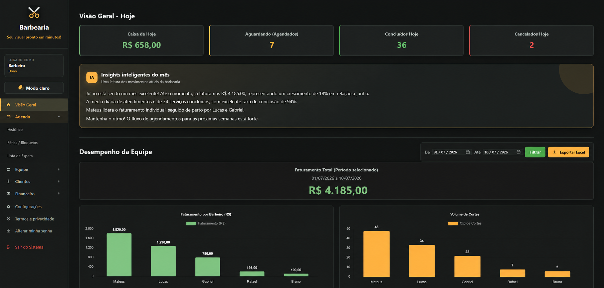

<br><br>

<table>
  <tr>
    <td align="center"><strong>Backend</strong><br>Python · Django 6</td>
    <td align="center"><strong>Banco</strong><br>PostgreSQL · SQLite</td>
    <td align="center"><strong>Frontend</strong><br>HTML · CSS · JavaScript</td>
    <td align="center"><strong>Deploy</strong><br>Render · Gunicorn</td>
  </tr>
</table>

</div>

---

## Visão geral

O **Barbearia SaaS** é uma plataforma web desenvolvida para barbearias que precisam centralizar sua operação em um sistema único, moderno e comercialmente utilizável.

A aplicação permite que múltiplas barbearias utilizem a mesma base do sistema de forma isolada através de uma arquitetura **multi-tenant**. Cada empresa possui seus próprios clientes, funcionários, serviços, configurações, financeiro, estoque e dados operacionais.

O projeto foi desenvolvido com foco em:

<table>
  <tr>
    <td><strong>Uso comercial</strong><br>Estrutura pensada para ser vendida como solução SaaS para pequenos negócios.</td>
    <td><strong>Segurança</strong><br>Isolamento por empresa, validação de entradas, permissões e aceite de termos.</td>
  </tr>
  <tr>
    <td><strong>Experiência visual</strong><br>Interface escura, moderna, com cards, dashboards e personalização por barbearia.</td>
    <td><strong>Escalabilidade</strong><br>Base preparada para múltiplos tenants, deploy em cloud e banco PostgreSQL.</td>
  </tr>
</table>

---

## Aviso de portfólio e propriedade

Este repositório está público para fins de **portfólio, demonstração de autoria e avaliação técnica**.

O projeto **não é open source**.

O código é proprietário e não pode ser copiado, modificado, distribuído, sublicenciado, hospedado, implantado, revendido, comercializado ou utilizado para operar um serviço concorrente/interno sem autorização prévia por escrito.

Consulte o arquivo [`LICENSE`](LICENSE).

---

<div align="center">


</div>

## Proposta do sistema

O objetivo da plataforma é substituir controles manuais, planilhas e processos descentralizados por um painel único de gestão.

Com o sistema, uma barbearia pode:

<table>
  <tr>
    <td><strong>Agenda</strong><br>Receber agendamentos online com escolha de profissional, serviço, data e horário.</td>
    <td><strong>Operação</strong><br>Controlar equipe, permissões, clientes, serviços, bloqueios e férias.</td>
  </tr>
  <tr>
    <td><strong>Financeiro</strong><br>Acompanhar fluxo de caixa, faturamento, comissões, receitas e despesas.</td>
    <td><strong>Comercial</strong><br>Criar cupons, planos mensais, avaliações, fidelidade e lista de espera.</td>
  </tr>
  <tr>
    <td><strong>Estoque</strong><br>Gerenciar produtos, quantidades, valores e alertas operacionais.</td>
    <td><strong>Marca</strong><br>Personalizar tema, cores, logo, capa, favicon e aparência pública.</td>
  </tr>
</table>

---

## Design e experiência do usuário

A interface foi pensada para ter aparência de produto SaaS, não apenas de sistema administrativo. O visual segue uma estética escura, com contraste alto, cards bem definidos, bordas suaves e cor de destaque em tom dourado/âmbar.

Essa escolha cria uma identidade mais próxima de ferramentas profissionais de gestão, mantendo boa leitura em dashboards, tabelas e formulários.

### Diretrizes visuais

| Elemento | Aplicação |
|---|---|
| Tema escuro | Base visual do painel administrativo |
| Tema claro | Alternativa configurável por barbearia |
| Cores de destaque | Botões, links ativos, gráficos, filtros e indicadores |
| Cards | Organização de métricas, formulários e módulos |
| Layout em grade | Melhor leitura de dashboards e relatórios |
| Tipografia limpa | Foco em legibilidade e uso profissional |
| Ícones funcionais | Apoio visual para navegação rápida |
| Espaçamento consistente | Redução de poluição visual |
| Feedback visual | Estados de botões, filtros, formulários e ações |

### Personalização por tenant

Cada barbearia pode ajustar elementos visuais da plataforma, permitindo que o sistema acompanhe sua identidade própria.

Entre as opções de personalização estão:

- nome da barbearia;
- slogan;
- logo;
- favicon;
- imagem de capa;
- imagem de fundo da área pública;
- cor principal do painel;
- cor dos botões;
- tema claro ou escuro;
- aparência da página pública de agendamento.

<p align="center">
  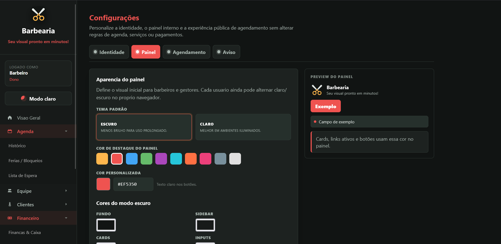
</p>

---

<div align="center">


</div>

## Principais recursos

| Gestão operacional | Comercial e relacionamento | Plataforma |
|---|---|---|
| Agendamentos online | Cupons de desconto | Multi-tenant |
| Cadastro de clientes | Planos mensais | Dashboard analítico |
| Gestão de equipe | Avaliações de atendimento | Permissões por perfil |
| Controle financeiro | Programa de fidelidade | LGPD e aceite de termos |
| Controle de estoque | Lista de espera | Personalização visual |
| Férias e bloqueios de agenda | WhatsApp para confirmação | Painel administrativo |
| Serviços e preços | Histórico por cliente | Deploy preparado |

---

## Demonstração visual

### Painel principal

O dashboard centraliza indicadores da operação, com visão de faturamento, agendamentos, desempenho e insights para tomada de decisão.

<p align="center">
  
</p>

---

### Gestão operacional

<p align="center">
  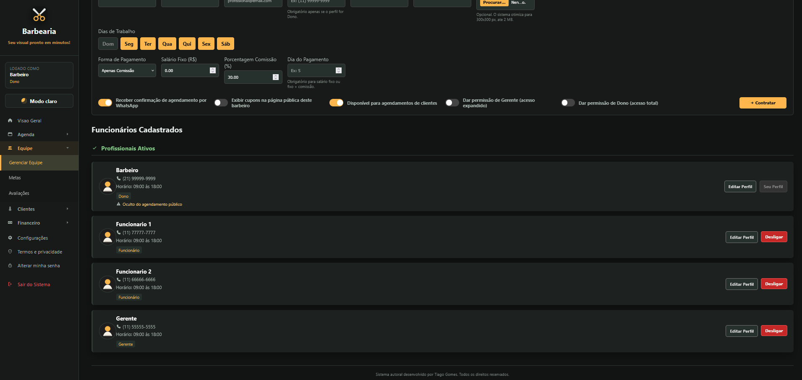
  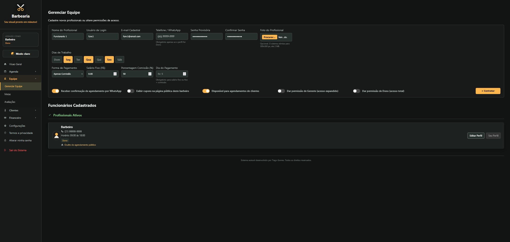
</p>

<p align="center">
  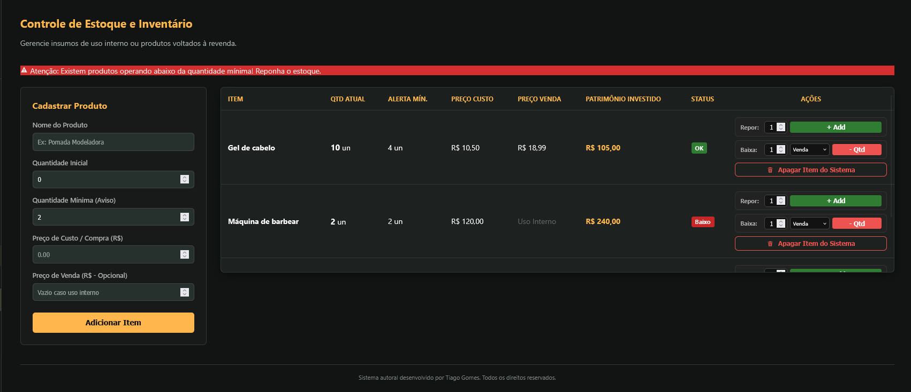
  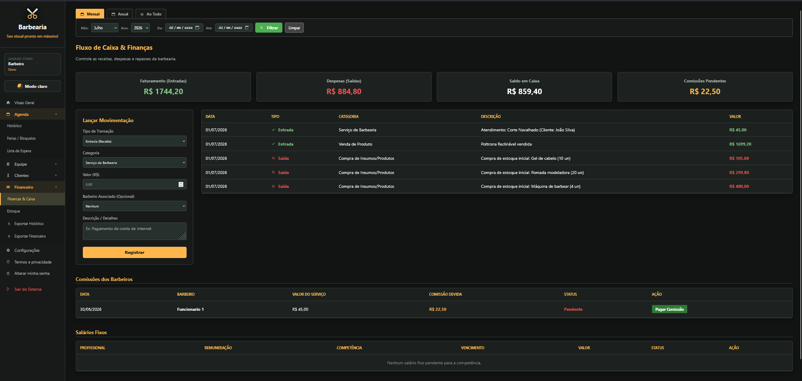
</p>

---

### Recursos comerciais

<p align="center">
  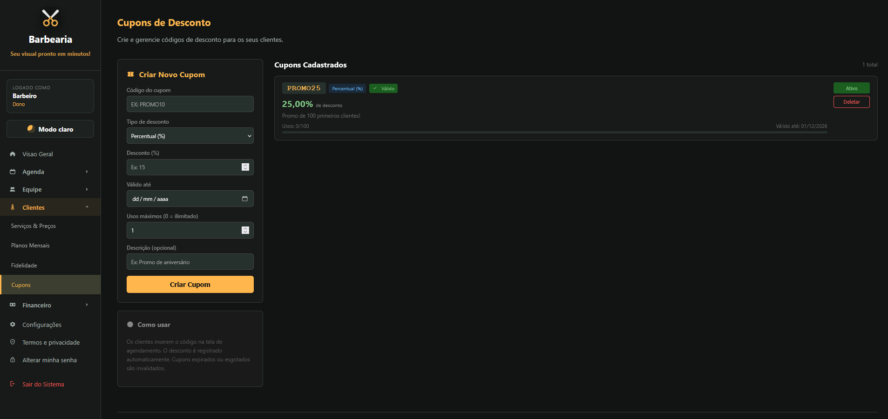
  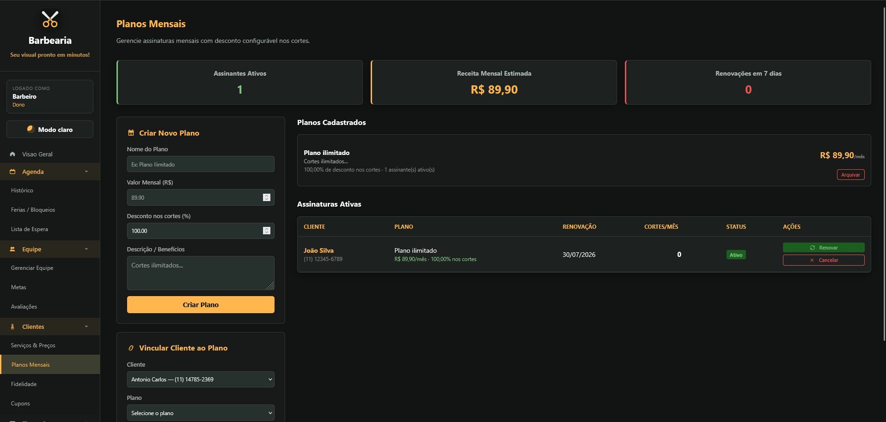
</p>

---

### Agendamento online

O fluxo público foi estruturado em etapas para reduzir atrito para o cliente final.

```text
Identificação do cliente
   |
   v
Escolha do profissional
   |
   v
Escolha do serviço
   |
   v
Seleção de data e horário
   |
   v
Confirmação do agendamento
```

<p align="center">
  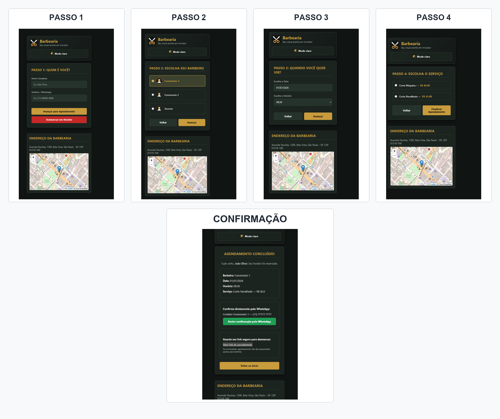
  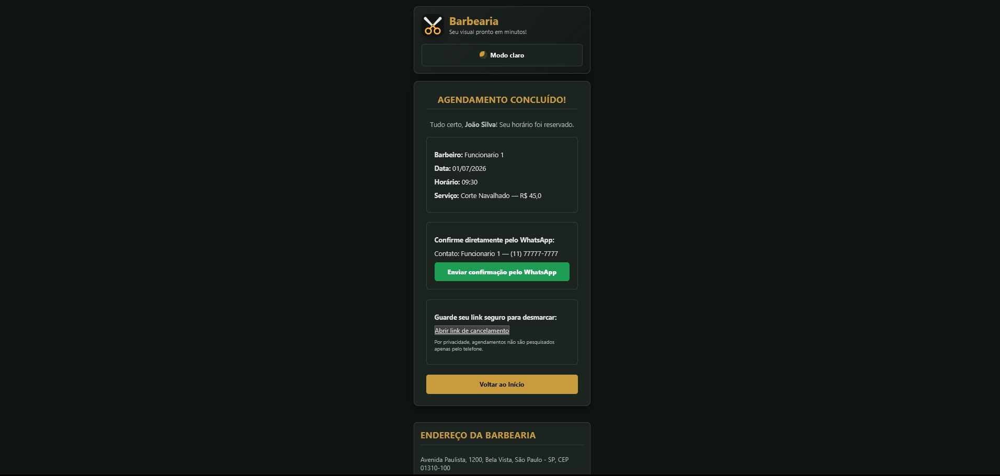
</p>

---

### Painel multi-tenant

A plataforma possui uma área administrativa para controle das empresas cadastradas, planos, status e operação geral dos tenants.

<p align="center">
  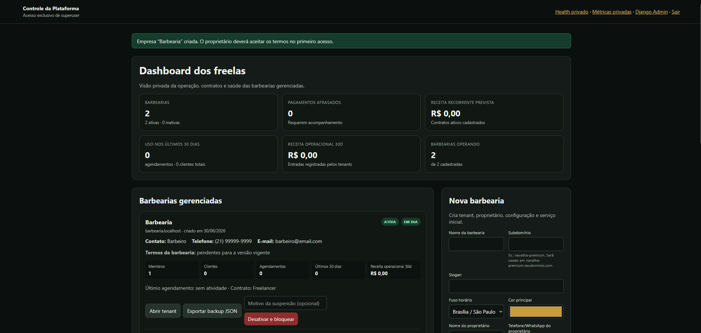
</p>

---

<div align="center">


</div>

## Arquitetura

```text
Cliente
   |
   v
Interface Web
HTML · CSS · JavaScript
   |
   v
Django 6
   |
   +-- Agendamentos
   +-- Clientes
   +-- Equipe
   +-- Financeiro
   +-- Estoque
   +-- Cupons
   +-- Planos
   +-- Avaliações
   +-- Configurações
   +-- Plataforma Multi-Tenant
   |
   v
PostgreSQL
```

A aplicação utiliza separação por empresa para manter os dados de cada barbearia isolados. O sistema possui middleware, managers e contexto de tenant para controlar o acesso aos dados de acordo com a empresa ativa.

---

## Módulos do sistema

<table>
  <tr>
    <th>Área pública do cliente</th>
    <th>Painel da barbearia</th>
    <th>Administração da plataforma</th>
  </tr>
  <tr>
    <td>
      Página pública de agendamento<br>
      Escolha de barbeiro<br>
      Escolha de serviço<br>
      Seleção de data e horário<br>
      Aplicação de cupom<br>
      Confirmação do agendamento<br>
      Link de cancelamento<br>
      Integração com WhatsApp<br>
      Lista de espera
    </td>
    <td>
      Dashboard com indicadores<br>
      Gestão de clientes<br>
      Gestão de equipe<br>
      Cadastro de serviços<br>
      Controle financeiro<br>
      Controle de comissões<br>
      Controle de estoque<br>
      Planos mensais<br>
      Cupons de desconto<br>
      Avaliações<br>
      Metas<br>
      Férias e bloqueios
    </td>
    <td>
      Cadastro de empresas<br>
      Controle de tenants<br>
      Status de pagamento<br>
      Plano contratado<br>
      Valor mensal<br>
      Próximo vencimento<br>
      Ativação e desativação<br>
      Observações internas<br>
      Backup por tenant
    </td>
  </tr>
</table>

---

## Segurança e boas práticas

O projeto inclui medidas importantes para uso em ambiente real:

| Camada | Implementação |
|---|---|
| Multi-tenancy | Isolamento de dados por empresa |
| Middleware | Resolução de tenant por contexto da requisição |
| Managers | Escopo automático para impedir acesso cruzado |
| Entradas HTTP | Validação global de campos, números, JSON e uploads |
| Autenticação | Sessões autenticadas e controle de acesso |
| Privacidade | Aceite versionado de termos e política de privacidade |
| Rate limit | Limites configuráveis para login e recursos sensíveis |
| Uploads | Sanitização e reprocessamento de imagens |
| Configuração | Uso de variáveis de ambiente |
| Deploy | Health check e workflow de monitoramento pós-deploy |

---

## Tecnologias utilizadas

| Categoria | Tecnologias |
|---|---|
| Backend | Python, Django 6 |
| Banco de dados | SQLite em desenvolvimento, PostgreSQL via `DATABASE_URL` em produção |
| Frontend | HTML, CSS, JavaScript, templates Django |
| Design/UI | Tema claro/escuro, cards, dashboards, layout responsivo e personalização por tenant |
| Interface e gráficos | Chart.js, Flatpickr |
| Arquivos estáticos | WhiteNoise |
| Cache | Redis opcional via `REDIS_URL` |
| Storage | S3 compatível opcional para mídia |
| Deploy | Render, Gunicorn |
| CI/CD | GitHub Actions |
| Configuração | Variáveis de ambiente com `.env` |

---

<div align="center">


</div>

## Estrutura do projeto

```text
.
├── agendamentos/
│   ├── models.py
│   ├── managers.py
│   ├── middleware.py
│   ├── security.py
│   ├── input_safety.py
│   ├── tenancy.py
│   ├── views/
│   ├── urls/
│   ├── templates/
│   └── static/
│
├── core/
│   ├── settings.py
│   ├── urls.py
│   ├── asgi.py
│   └── wsgi.py
│
├── docs/
│   ├── images/
│   ├── MULTITENANCY.md
│   ├── QA_MULTITENANT.md
│   └── SECURITY_LGPD.md
│
├── requirements.txt
├── render.yaml
├── gunicorn.conf.py
├── build.sh
├── manage.py
└── README.md
```

---

## Como executar localmente

### 1. Clonar o repositório

```bash
git clone https://github.com/SEU-USUARIO/SEU-REPOSITORIO.git
cd SEU-REPOSITORIO
```

### 2. Criar ambiente virtual

```bash
python -m venv .venv
```

### 3. Ativar o ambiente virtual

Windows:

```bash
.venv\Scripts\activate
```

Linux/macOS:

```bash
source .venv/bin/activate
```

### 4. Instalar dependências

```bash
pip install -r requirements.txt
```

### 5. Configurar variáveis de ambiente

Crie um arquivo `.env` com base no exemplo:

```bash
cp .env.example .env
```

No Windows:

```bash
copy .env.example .env
```

Depois ajuste as variáveis necessárias.

### 6. Executar migrações

```bash
python manage.py migrate
```

### 7. Criar superusuário

```bash
python manage.py createsuperuser
```

### 8. Rodar o servidor

```bash
python manage.py runserver
```

Acesse:

```text
http://127.0.0.1:8000/
```

---

## Variáveis de ambiente

O projeto utiliza variáveis de ambiente para manter configurações sensíveis fora do código.

Algumas das principais configurações:

```env
SECRET_KEY=
DEBUG=
ALLOWED_HOSTS=
CSRF_TRUSTED_ORIGINS=

DATABASE_URL=
DB_SSL_REQUIRE=

TENANT_BASE_DOMAIN=
TENANT_ALLOW_SINGLE_FALLBACK=

REDIS_URL=

TERMS_VERSION=
PRIVACY_POLICY_VERSION=

LOGIN_RATE_LIMIT_IP=
LOGIN_RATE_LIMIT_USERNAME=
LOGIN_RATE_LIMIT_WINDOW=
```

O arquivo `.env.example` contém um modelo completo das variáveis esperadas.

---

## Release notes

- Segredos devem existir apenas em variáveis de ambiente.
- Bancos locais, uploads, arquivos estáticos gerados, exports e anotações privadas são ignorados pelo Git.
- Um deploy novo deve executar `python manage.py migrate` contra um banco de produção vazio.
- Em produção, utilize `DEBUG=False`.
- Em produção, configure corretamente `ALLOWED_HOSTS`, `CSRF_TRUSTED_ORIGINS` e cookies seguros.
- Para múltiplos workers ou instâncias, configure Redis para cache e rate limit compartilhados.

---

## Deploy

O projeto possui arquivos de suporte para deploy em ambiente cloud:

- `render.yaml`
- `gunicorn.conf.py`
- `build.sh`
- workflow de monitoramento pós-deploy em `.github/workflows/`

A aplicação foi preparada para uso com:

- Render;
- Supabase PostgreSQL;
- variáveis de ambiente;
- health check;
- execução via Gunicorn.

---

## Documentação técnica

O repositório também possui documentação complementar:

```text
docs/MULTITENANCY.md
docs/QA_MULTITENANT.md
docs/SECURITY_LGPD.md
```

Esses documentos abordam decisões técnicas relacionadas a multi-tenancy, segurança, LGPD e validações de qualidade.

---

## Status do projeto

Projeto em desenvolvimento ativo.

A plataforma já possui os principais módulos funcionais para operação de uma barbearia, incluindo agendamento, gestão interna, financeiro, estoque, equipe, planos, cupons, avaliações e administração multi-tenant.

Melhorias futuras podem incluir:

- integração com gateway de pagamento;
- notificações automáticas;
- relatórios avançados;
- painel público institucional;
- testes automatizados adicionais;
- melhorias de UI/UX;
- API pública para integrações externas.

---

## Objetivo comercial

Este projeto foi desenvolvido com objetivo de uso real como solução SaaS para barbearias.

Além de servir como projeto de portfólio, a aplicação foi pensada para ser comercializada para pequenos negócios que precisam digitalizar o agendamento e a gestão operacional.

---

## Autor

**Tiago Gomes**

Desenvolvedor Python/Django

Foco em backend, sistemas web, automação, banco de dados e aplicações SaaS.

```text
Python · Django · PostgreSQL · JavaScript · HTML · CSS · Git · Deploy
```

---

## Licença

Este projeto está sob licença proprietária.

O código está disponível publicamente apenas para demonstração, portfólio e avaliação técnica. Nenhuma permissão é concedida para cópia, modificação, distribuição, hospedagem, uso comercial, revenda ou criação de produtos derivados sem autorização prévia por escrito.

Consulte o arquivo [`LICENSE`](LICENSE).

<div align="center">


</div>